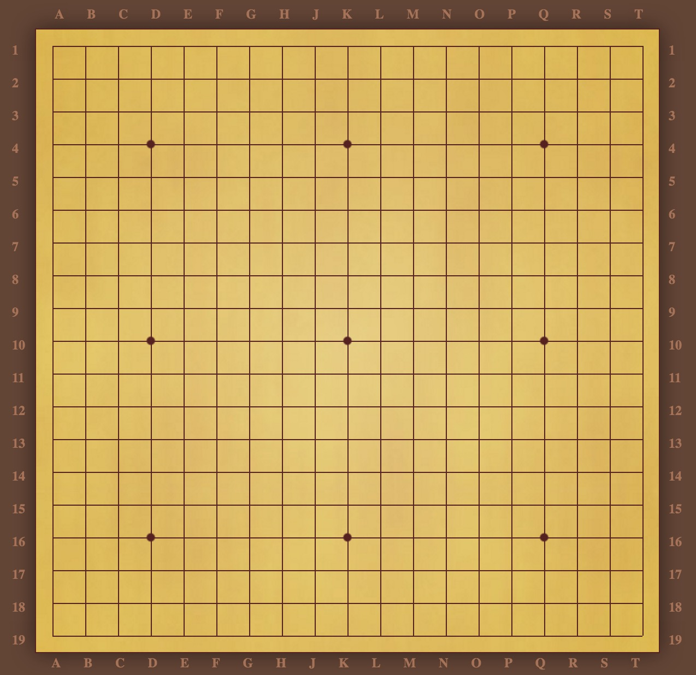
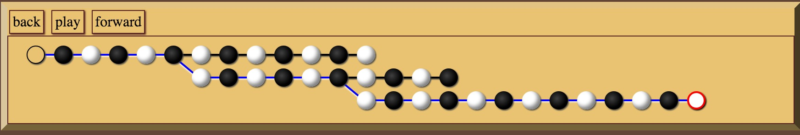
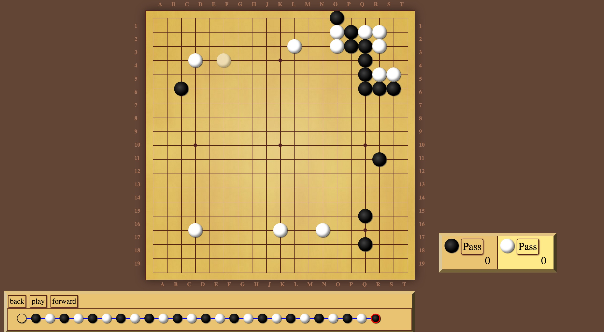

# Go (Weiqi)

It's an interactive Go board, can be used to go through game records of professional players or play human vs human game. *Note: game records cannot be saved yet.* 

网页版围棋棋盘，可用于打谱或对弈，注意：不可存档。

 `HTML` `CSS` `JavaScript` `jQuery`

#### What is Go?

Go (traditional Chinese: 圍棋; simplified Chinese: 围棋;  Japanese: 囲碁; rōmaji: igo[nb 2]; Korean: 바둑; literally: "encircling game") is an abstract strategy board game for two players, in which the aim is to surround more territory than the opponent.   (*Wikipedia*)

In this game, each player tries to use threats of death, capture , or isolation to assert control over more of the board than his opponent. 

An abstract strategy game at heart, Go has nonetheless been interpreted as a stylized representation of fighting a war, settling a frontier, cornering a market, thrashing out an argument, or even of fortune-telling and prophecy. 

Go has always been one of the most played games in the world. Top level international competitions can make the best players millionaires.

#### Gu Rules & Resources

English: 

http://www.usgo.org/rules-go 

https://gogameguru.com/ 

http://www.uclago.com/resource.html

http://senseis.xmp.net/?ChineseGoTerms

https://www.gokgs.com/

中文：

http://www.weiqitv.com/

http://www.weiqiok.com/asp/ShowAllProblems.asp

http://eweiqi.com/

http://www.gochess.cn/portal.php

http://www.101weiqi.com/

Credit: Original code comes from http://codepen.io/drshoggoth/